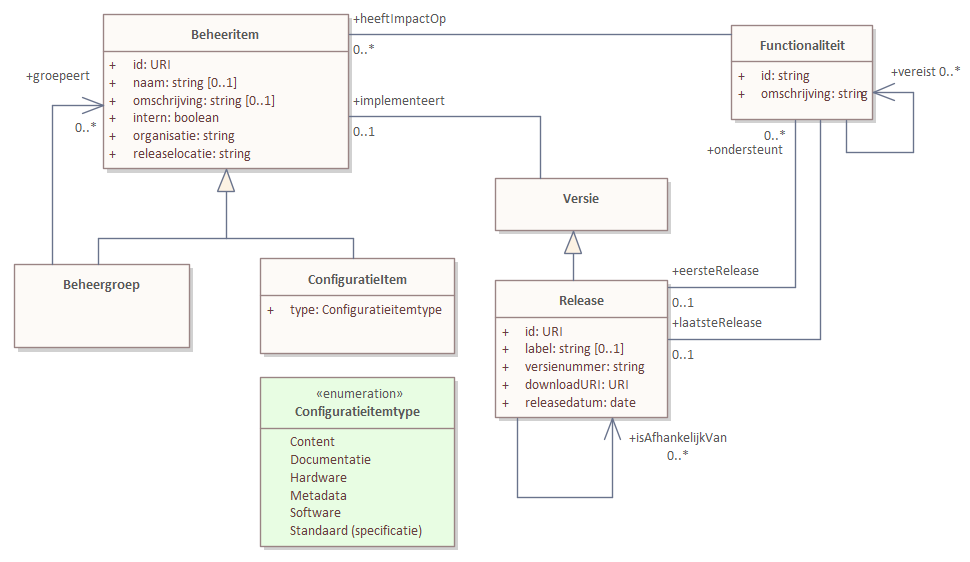
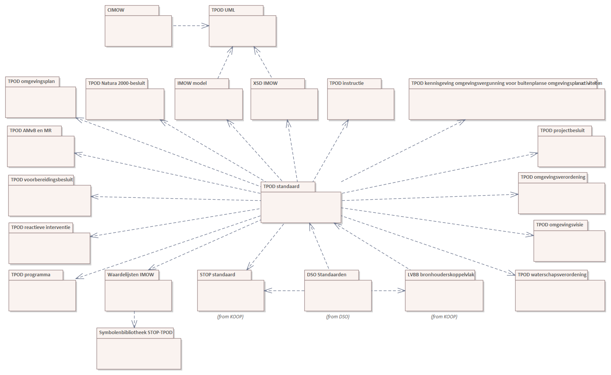

# dso-configuratiemanagement
Beheer van configuratie items die van belang zijn voor het DSO. Conceptueel wordt hier het volgende model voor gebruikt

Inhoudelijk beschrijft het volgende plaatje de Beheeritems van Geonovum met afhankelijkheden. De inhoud van dit plaatje inclusief omschrijvingen van de packages etc. is ook machineleesbaar beschikbaar in het estande ConfiguratieItems.sqlite.

De bestanden in dit repository zijn:
|  file | omschrijving |
| ----|----|
| ConfiguratieItems.sqlite | database met configuratieitems. |
| MakeDependencyGraph.sql | script om dependency graph te maken die bijvoorbeeld met Gephi gevisualiseerd kan worden. |
| MakeRelease.sql | Voorbeeldscript om release leesbaar uit database te halen.|
| create.sql | SQL om lege dependency database te maken. |
| Makefile | Makefile. |
| data/*   | sql scripts om database te vullen. |
| docs/*    | website gegenereerd vanuit database. |
| README.md | Dit bestand. |

