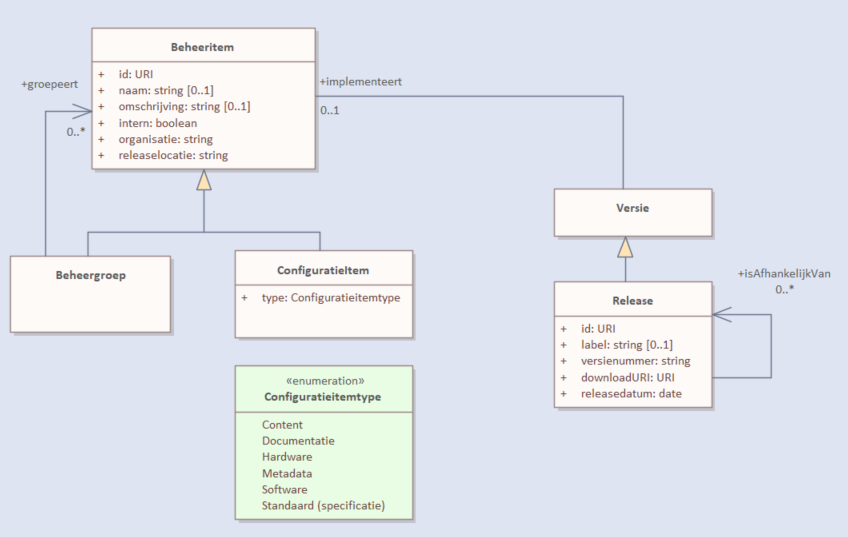

# dso-configuratiemanagement
Beheer van configuratie items die van belang zijn voor het DSO. Conceptueel wordt hier het volgende model voor gebruikt

|  file | omschrijving |
| ----|----|
| ConfiguratieItems.sqlite | database met configuratieitems. |
| MakeDependencyGraph.sql | script om dependency graph te maken die bijvoorbeeld met Gephi gevisualiseerd kan worden. |
| MakeRelease.sql | Voorbeels script om release leesbaar uit database te halen.|
| create.sql | SQL om lege dependency database te maken. |
| Makefile | Makefile. |
| data/*   | sql scripts to fill the dependency database. |
| web/*    | website gegenereerd vanuit database. |
| README.md | Dit bestand. |

