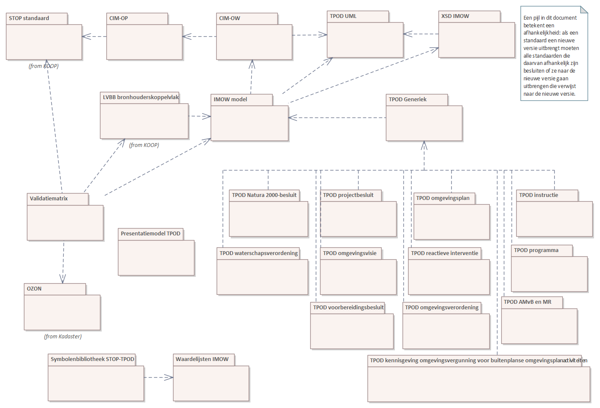

# dso-configuratiemanagement
Beheer van configuratie items die van belang zijn voor het DSO. Conceptueel wordt hier het volgende model voor gebruikt

Dit ropository is een proof of concept voor een database van de Beheeritems van Geonovum met afhankelijkeden. De database zit in een de file [ConfiguratieItems.sqlite](ConfiguratieItems.sqlite).
Uit deze database wordt een [website](https://geonovum.github.io/dso-configuratiemanagement/) gemaakt.

De bestanden in dit repository zijn:
|  file | omschrijving |
| ----|----|
| ConfiguratieItems.sqlite | database met configuratieitems. |
| MakeDependencyGraph.sql | script om dependency graph te maken die bijvoorbeeld met Gephi gevisualiseerd kan worden. |
| MakeRelease.sql | Voorbeeldscript om release leesbaar uit database te halen.|
| create.sql | SQL om lege dependency database te maken. |
| Makefile | Makefile. |
| data/*   | sql scripts om database te vullen. |
| docs/*    | website gegenereerd vanuit database. |
| README.md | Dit bestand. |

